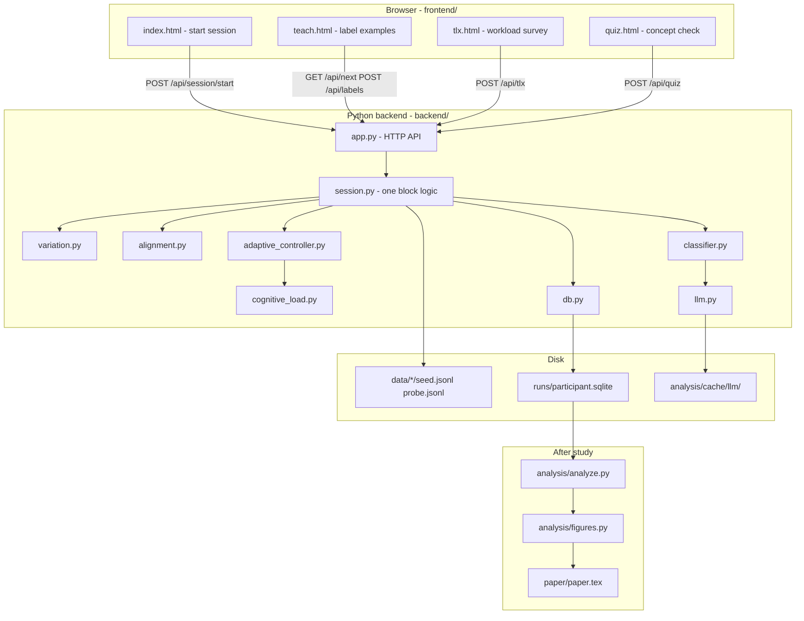
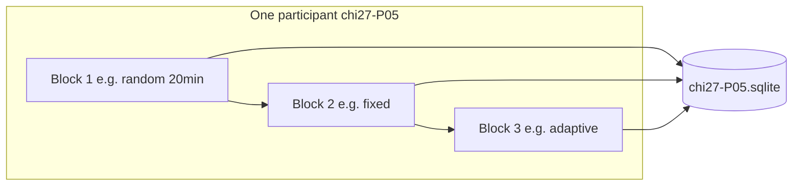

# Adaptive MOCHA — How the project works (deep guide)

This document explains **what** Adaptive MOCHA is, **why** it exists, and **how every part works together** — from the moment a participant clicks a label to the numbers in a CHI paper.

For running the study step-by-step, see also:
- [study/CHI_PUBLICATION_GUIDE.md](study/CHI_PUBLICATION_GUIDE.md) — collect real data and publish
- [HANDOFF.md](HANDOFF.md) — what is done vs what you still need to do

---

## 1. The big picture in one paragraph

**Adaptive MOCHA** is a research system where a **human teaches an AI** to recognize a fuzzy concept (for example: “overall sentiment of a movie review” or “is this argument well supported?”). The human reads short texts and assigns labels. Those labels are added to an **LLM-based classifier’s** prompt. After each teaching block, we measure how well that classifier labels a **hidden test set** the human never saw during teaching.

The scientific question is: **does it help to (a) show examples in a structured, theory-driven way (MOCHA), and (b) adapt the pace to the human’s cognitive load (Adaptive)?** We compare three strategies in the same app: **Random**, **MOCHA-Fixed**, and **MOCHA-Adaptive**.

Everything you click is saved in **`runs/<participant_id>.sqlite`**. Analysis scripts read those files and produce statistics and figures for the paper.

---

## 2. The research story (why three conditions?)

This project extends **MOCHA** (Gebreegziabher et al., 2024), which used two ideas from learning science:

| Theory | Idea in plain language | What the code does |
|--------|------------------------|-------------------|
| **Variation Theory** (Marton) | You learn a concept by seeing examples that **differ on one important feature** while other things stay similar | Picks or generates “boundary” examples; pairs items that change on exactly one axis (e.g. `hedging: none` vs `hedging: heavy`) |
| **Structural Alignment** (Gentner) | Two examples are easiest to compare when they are **aligned** — same structure, one critical difference | Groups examples into **trials** (side-by-side cards) with a short explanation banner |

**Our addition:** **Cognitive Load Theory**. If the person is overloaded (slow, missing easy items, says “this is hard”), the **Adaptive** condition eases off: easier examples, smaller batches, longer pauses. **Random** and **MOCHA-Fixed** do not change pace based on load.

| Condition | Example selection | Grouping / teaching structure | Pacing |
|-----------|-------------------|------------------------------|--------|
| **Random** | Shuffled from the pool | One text per screen | Fixed |
| **MOCHA-Fixed** | Structured pairs/triples (Variation + Alignment) | Yellow “compare these” banner | Fixed |
| **MOCHA-Adaptive** | Same structured trials as Fixed | Same banner | **Changes** from estimated cognitive load |

The **same LLM classifier** is used in all three conditions. Only the **teaching experience** changes. That way, differences in results are attributed to teaching strategy, not to a different model.

---

## 3. The two domains (what participants are teaching)

Each participant works on **one domain** for all three blocks (assigned in `study/assignment_main.csv`).

### Domain D1 — Mixed-sentiment movie reviews (`d1`)

- **Concept:** Overall sentiment of a 1–2 sentence review, even when the review mixes positive and negative phrases.
- **Labels:** `positive`, `negative`, `mixed`
- **Data files:** `data/d1_sentiment/seed.jsonl` (teaching pool), `probe.jsonl` (hidden test), `quiz.jsonl` (12 quiz questions)

### Domain D2 — Argument quality (`d2`)

- **Concept:** Is the evidence in the paragraph strong enough for the claim?
- **Labels:** `strong`, `weak`, `borderline`
- **Data files:** `data/d2_argquality/...`

Each example in the seed pool has **metadata**: `label`, `difficulty` (0–1), and `features` (e.g. `surface_contrast`, `evidence_type`). That metadata is used to build aligned pairs and to filter easy/hard trials — it is **not** shown to the participant (they only see the text).

---

## 4. Architecture — how the pieces connect



**Important:** The server keeps active sessions **in memory** (`SESSIONS` dict in `app.py`). The **permanent record** is always SQLite on disk.

---

## 5. One full participant visit — step by step

A real study visit has **three blocks** (three conditions). Below is **one block**; you repeat with a different `condition` on the home page, same `participant_id`.

### Step A — Researcher starts the server

```powershell
cd adaptive-mocha
.\.venv\Scripts\activate
python -m uvicorn backend.app:app --host 127.0.0.1 --port 8000
```

The server reads **`.env`** (not `.env.example`): API provider, block length (`AM_BLOCK_SECONDS`), etc.

### Step B — Home page (`/`)

Researcher opens http://127.0.0.1:8000/ and enters:

- **Participant ID** — e.g. `chi27-P05` → creates/uses `runs/chi27-P05.sqlite`
- **Domain** — `d1` or `d2`
- **Condition** — `random`, `fixed`, or `adaptive`

Click **Start teaching block**.

**What happens in code:**

1. Browser `POST /api/session/start` with `{ participant, domain, condition }`.
2. `app.py` creates a `Session` object (`session.py`).
3. `Session.__post_init__`:
   - Loads seed + probe JSONL for the domain
   - Builds the list of **trials** (see Section 6)
   - Creates a **Classifier** (empty taught list)
   - Picks **FixedController** or **AdaptiveController**
   - Calls `db.new_session(...)` → writes row in `sessions` table, creates SQLite file if needed
4. Response JSON is stored in browser `sessionStorage` as `am` (participant, labels, `block_seconds`, flags).
5. Browser redirects to `/teach`.

### Step C — Teaching block (`/teach`) — the core loop

The page starts a **countdown** (`block_seconds` from server, e.g. 1200 = 20 minutes).

**Loop until timer ends:**

1. **Fetch next trial** — `GET /api/next?participant=...&condition=...`
2. **Show** text(s), label buttons, optional “why?” box
3. User clicks labels → **Submit & next** — `POST /api/labels`
4. Short pause (`inter_trial_ms` from controller)
5. Go to 1

**When timer hits 0:**

1. `POST /api/evaluate` — classifier labels entire **probe set**; accuracy saved
2. Redirect to `/tlx` → then `/quiz` → `POST /api/session/end`

You are **not** expected to click continuously for 20 minutes without pause — you control pace between submissions; the timer only ends the block.

### Step D — After one block

Same participant, **new condition**: go back to home, same ID, different condition, start again → **second row** in `sessions` table, same `.sqlite` file.

After three blocks + interview (outside app), one person’s file holds the full within-subjects data.

---

## 6. How trials are built (before you see anything)

When `Session` starts, `_materialize_trials()` runs once per block.

### Condition: Random

```text
seed pool (72 items) → shuffle → one item per trial
```

Each screen shows **one** review/paragraph.

### Conditions: Fixed and Adaptive

```text
seed pool
  → pick_boundary_neighbours()   # symbolic Variation: same pool, 1 feature differs
  → build_trials()               # pairs + triples that differ on exactly 1 axis
  → trials_with_variations()     # optional seed + neighbour pairs
  → combined trial list (sorted by difficulty)
```

Each **trial** is a `Trial` object (`alignment.py`):

- `items` — 1–3 example dicts to show
- `contrast_axis` — which feature differs (e.g. `intensity`)
- `rationale` — text for the yellow banner (“Notice how …”)
- `difficulty` — average difficulty, used for filtering

**Fixed vs Adaptive** use the **same trial-building code**. The difference is only **which trial is chosen next** and **pause length** (Section 7).

---

## 7. What happens on each “Submit & next” (deep dive)

This is the heart of the co-adaptive loop.

### 7.1 Choosing the next trial (`Session.next_trial`)

1. **Estimate cognitive load** (`cognitive_load.py`):
   - Rolling **dwell time** (how long labels take) vs your personal baseline
   - **Calibration accuracy** on easy items (`difficulty < 0.3`)
   - **Self-report** from mid-block popups (Adaptive only, minutes 8 and 14)

   Combined: `load = 0.45×dwell + 0.35×calibration + 0.20×self_report` (each part 0–1).

2. **Controller decides** (`adaptive_controller.py`):

   | Load | Band | Batch size | Pause after submit |
   |------|------|------------|-------------------|
   | High (≥ 0.65) | easy | 2 | 1500 ms |
   | Low (≤ 0.35) | hard | 3 | 250 ms |
   | Middle | medium | 2 | 750 ms |

   **Fixed** condition always returns medium / 2 / 800 ms — load is ignored.

3. **Filter trials** by difficulty band (`easy` / `medium` / `hard`).

4. Walk the trial list with a **cursor**; open the next matching trial as an `open_ticket` (waiting for labels).

5. **Log** `controller.decision` event to SQLite (for fig2_controller in the paper).

### 7.2 Participant submits labels (`Session.submit_labels`)

For each visible item in the trial:

1. **Save to SQLite** `labels` table: example id, chosen label, optional rationale, dwell time, controller snapshot.
2. **Teach the classifier** — `classifier.teach(text, label, rationale)` appends to an in-memory list.

The **Classifier** (`classifier.py`) does not retrain weights. It is an **LLM with a growing prompt**:

```text
System: [concept definition for D1 or D2]
User:   Here are examples you were taught:
        - TEACH | text: '...' | label: positive
        - TEACH | text: '...' | label: negative
        Now classify: '...'
```

Each `predict()` call goes through `llm.py` (OpenAI, Anthropic, Ollama, or **mock** for offline tests).

3. **Update load estimator** with dwell time and calibration result.

4. Clear `open_ticket`; frontend waits `inter_trial_ms` then fetches next trial.

### 7.3 End of block — evaluation

`evaluate_classifier()` runs the classifier on every item in **`probe.jsonl`** (50 items, never shown during teaching). Writes to `classifier_eval`:

- `accuracy`, `macro_f1`, per-example predictions

This is the **primary paper outcome**: “After teaching, how well does the model classify hidden examples?”

---

## 8. The LLM layer (`backend/llm.py`)

All LLM calls go through one function: `complete(messages)`.

| Provider (`AM_PROVIDER`) | Use case |
|--------------------------|----------|
| `mock` | No API key; token-overlap over taught examples; good for UI tests |
| `openai` | Real study (`gpt-4o-mini` default) |
| `anthropic` | Fallback |
| `ollama` | Local CPU model |

Features:

- **Disk cache** — same prompt → same file in `analysis/cache/llm/` (saves money, reproducibility)
- **Token budget** — `AM_TOKEN_BUDGET` caps total tokens per server run

The LLM is used for:

1. **Classifying** probe items (main evaluation)
2. Optionally **generating** counterfactuals (`variation.py` — can use symbolic path instead)

Participant **rationale text is stored in SQLite** but is **not** sent to the API in the current design (privacy / IRB-friendly).

---

## 9. What gets saved in SQLite

File: `runs/<participant_id>.sqlite`  
Example: `runs/chi27-P05.sqlite` — **one file per person**, three `sessions` rows after a full visit.

| Table | One row means |
|-------|----------------|
| `sessions` | One teaching block (one condition) started/ended |
| `labels` | One labeled example (with dwell ms, controller state) |
| `events` | Controller decisions, micro-TLX, session start/end |
| `tlx` | One NASA-TLX submission after a block |
| `quiz` | One quiz question answered |
| `classifier_eval` | Probe-set accuracy after a block |

**Analysis** (`analysis/load.py`) loads all `runs/chi27-*.sqlite` files and merges tables for statistics.

---

## 10. Frontend pages (what each file does)

| File | Role |
|------|------|
| `index.html` + `console.js` | Start session; call `/api/session/start`; save JSON to `sessionStorage`; go to teach |
| `teach.html` + `teach.js` | Timer, fetch trials, render labels, micro-TLX popups (Adaptive), evaluate at end |
| `tlx.html` + `tlx.js` | Six NASA-TLX sliders → `/api/tlx` |
| `quiz.html` + `quiz.js` | 12 items from `/api/quiz_items` → `/api/quiz` → `/api/session/end` |
| `style.css` | Shared styling |

The frontend has **no build step** (plain HTML/JS). The backend serves it under `/static/`.

---

## 11. Full study design (how 24 participants fit in)



- **Within-subjects:** everyone gets Random, Fixed, and Adaptive (order counterbalanced).
- **Between-subjects on domain:** 12 people on D1, 12 on D2.
- **Assignment:** `python scripts/assign_order.py --n 24 --id-prefix chi27`

**Do not confuse:**

- `runs/mainstudy-P*.sqlite` — **synthetic** fake participants for testing analysis; not for the paper
- `runs/chi27-P*.sqlite` — **real** study data (after IRB + human sessions)

---

## 12. After data collection — analysis → paper

```text
runs/chi27-*.sqlite
    → analysis/load.py          (pandas tables)
    → analysis/analyze.py       (mixed models, contrasts, report.json)
    → analysis/figures.py       (PDF/PNG figures)
    → paper/paper.tex           (replace \chiplaceholder{...} with real numbers)
```

**Primary hypothesis (H1):** Adaptive ≥ Fixed > Random on post-block **probe accuracy**.

**Secondary:** NASA-TLX (lower is better), quiz score (higher is better), dwell time.

---

## 13. Project folder map (what to open when)

```text
adaptive-mocha/
├── .env                 ← YOU configure this (API, block length)
├── backend/
│   ├── app.py           ← HTTP routes
│   ├── session.py       ← Per-block orchestration (start here to understand logic)
│   ├── variation.py     ← Counterfactual / neighbour examples
│   ├── alignment.py     ← Trial pairs and triples
│   ├── adaptive_controller.py
│   ├── cognitive_load.py
│   ├── classifier.py    ← LLM + taught examples
│   ├── llm.py           ← API / mock / cache
│   └── db.py            ← SQLite schema
├── frontend/            ← Browser UI
├── data/                ← seed, probe, quiz JSONL
├── runs/                ← One .sqlite per participant ID
├── study/               ← IRB, protocol, CHI_PUBLICATION_GUIDE.md
├── analysis/            ← Stats and figures
├── paper/               ← LaTeX manuscript
└── tests/               ← pytest (16 tests)
```

---

## 14. Quick start (try it in 5 minutes)

```powershell
cd "c:\SDL2-2.26.3\CHI RESEARCH\adaptive-mocha"
.\.venv\Scripts\activate
# Ensure .env exists with AM_PROVIDER=mock and AM_BLOCK_SECONDS=120
python -m uvicorn backend.app:app --host 127.0.0.1 --port 8000
```

1. Open http://127.0.0.1:8000/
2. Participant: `test-me`, Domain: D1, Condition: `adaptive`
3. Label a few examples until timer ends (2 min if `AM_BLOCK_SECONDS=120`)
4. Complete TLX and quiz
5. Check: `dir runs\test-me.sqlite`

Verify server config: http://127.0.0.1:8000/health → `"block_seconds": 120`

---

## 15. Mental model checklist

Use this to check your understanding:

- [ ] **One Session** = one condition block for one person, not the whole visit.
- [ ] **Three sessions** = three rows in SQLite, same file, same participant ID.
- [ ] **Teaching** updates the classifier’s in-context examples; **evaluation** uses hidden probe set.
- [ ] **Random** = no pairs; **Fixed/Adaptive** = structured pairs + banner.
- [ ] **Adaptive** = Fixed trials + load-based pacing; not a different trial generator.
- [ ] **Participant ID** = SQLite filename (`chi27-P01` → `runs/chi27-P01.sqlite`).
- [ ] **`.env`** controls timer and API; restart server after changes.
- [ ] **Paper numbers** come only from real `chi27-*` human data, not `mainstudy-*`.

---

## 16. License and citation

Apache-2.0. See [LICENSE](LICENSE).

Based on MOCHA (Gebreegziabher et al., arXiv:2409.16561). This repository is an independent extension for CHI 2027.
